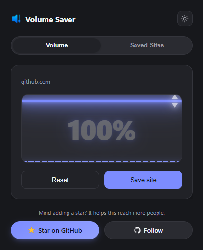
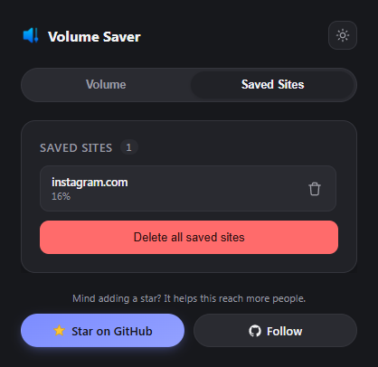
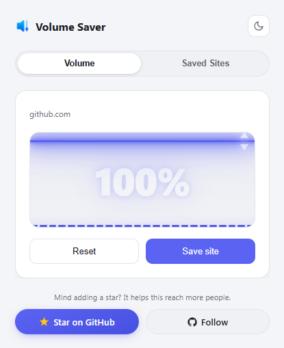

# Simple Volume Saver

Chrome extension (Manifest V3) that sets and remembers the audio volume for each site, with a live visualizer of the tab's real audio output.

<table>
  <tr>
    <td></td>
    <td></td>
    <td></td>
  </tr>
</table>

## How it works

- Sets the volume of `<video>`/`<audio>` elements on the page directly, independent of the site's own player.
- Saves a level per origin (`https://example.com`) in `chrome.storage.sync`. The level is applied again on later visits, including to media added after the page loads.
- The visualizer uses `chrome.tabCapture` to analyze the tab's final mixed output, so it works on sites with their own audio pipeline (YouTube, Spotify).
- UI: a draggable fader (also arrow keys, Home and End), a saved sites list, dark and light themes.

## Permissions

| Permission | Why |
|---|---|
| `storage` | Saved levels and theme |
| `scripting`, `activeTab`, `<all_urls>` | Reads and sets media volume, applies saved levels after navigation |
| `tabs` | Detects when a tab starts playing audio |
| `tabCapture` | Visualizer only. Audio is analyzed in memory and sent back to the speakers; nothing is recorded or sent |

## Install

1. Open `chrome://extensions` and enable Developer mode.
2. Click **Load unpacked** and select this folder.

## Limits

- Heavily customized players may not respond.
- The visualizer does not work on internal pages (`chrome://`).
- Volume above 100% is not supported, because it breaks fullscreen video.
